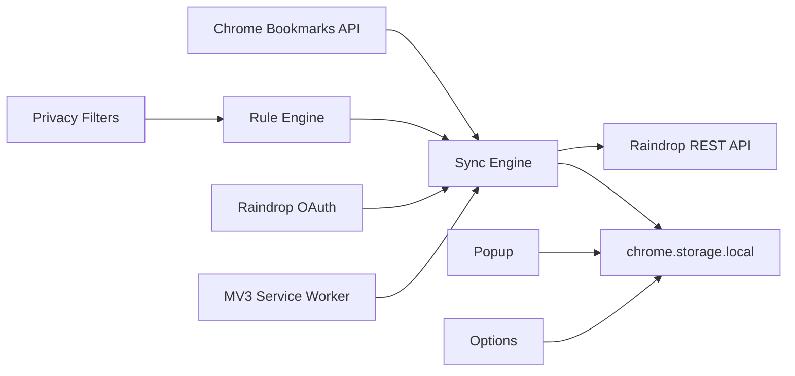

# Technical Design

## 架构



## 核心模块

- `src/core/storage.js`
  - 保存 settings、syncState、syncLogs
  - 合并默认设置，避免升级后字段缺失

- `src/core/rules.js`
  - 创建与标准化规则
  - 判断 bookmark 是否应同步
  - 当前强制 direction 为 `chrome-to-raindrop`

- `src/core/privacy.js`
  - URL、标题、路径敏感过滤
  - 日志脱敏

- `src/core/chrome-bookmarks.js`
  - 读取 Chrome 文件夹树
  - 按规则列出文件夹下书签

- `src/core/raindrop-auth.js`
  - 使用 `chrome.identity.launchWebAuthFlow` 打开 Raindrop 授权页
  - 通过 authorization code 换取 access token 和 refresh token
  - access token 过期前自动 refresh

- `src/core/raindrop-api.js`
  - Raindrop REST API 封装
  - 创建、更新、归档 raindrop item

- `src/core/sync-engine.js`
  - 遍历启用规则
  - 对每条书签执行过滤和同步
  - 维护 Chrome bookmark id 到 Raindrop id 的映射
  - 对已消失书签执行归档策略

## 数据模型

### Rule

```json
{
  "id": "uuid",
  "name": "工作书签备份",
  "enabled": true,
  "direction": "chrome-to-raindrop",
  "sourceChromeFolderId": "123",
  "targetRaindropCollectionId": 456,
  "excludePaths": ["工作资料/私人临时"],
  "domainBlocklist": ["bank.example"],
  "tags": ["chrome-backup"],
  "deletePolicy": "archive",
  "scheduleMinutes": 30
}
```

### Sync State

```json
{
  "knownBookmarks": {
    "chromeBookmarkId": {
      "ruleId": "uuid",
      "url": "https://example.com",
      "title": "Example",
      "path": "Bookmarks Bar / Work",
      "lastSeenAt": "iso"
    }
  },
  "bookmarkToRaindrop": {
    "chromeBookmarkId": {
      "raindropId": 123,
      "ruleId": "uuid",
      "lastSyncedAt": "iso"
    }
  }
}
```

## 风险与保护

- Token 缺失：只写日志，不同步
- Token 过期：优先用 refresh token 自动续期
- 规则缺失：只写日志，不同步
- 敏感命中：跳过同步，日志脱敏
- Chrome 删除：默认归档 Raindrop item
- Office Mode：popup 与日志不展示书签标题和 URL

## 已知限制

- OAuth token exchange 需要 client secret，公开发布前应增加后端 token broker
- 尚未做内容 hash，因此已映射项会执行更新请求
- 尚未做批量删除阈值保护
- Raindrop 归档语义需要在真实账号中进一步验证
